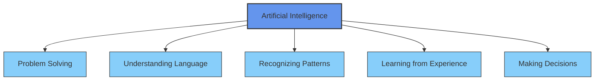
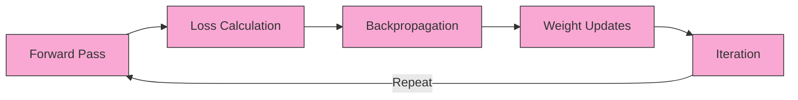
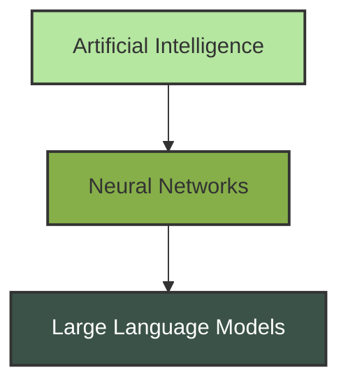

<div align="center">

# 🧠 Understanding AI Technologies

[](https://github.com/yourusername/ai-technologies)
[](https://github.com/yourusername/ai-technologies)
[](https://github.com/yourusername/ai-technologies)

**A comprehensive guide to Artificial Intelligence, Neural Networks, and Large Language Models**

</div>

---

## 📚 Table of Contents

- [🌟 Introduction](#introduction)
- [🤖 Artificial Intelligence](#artificial-intelligence-the-quest-to-create-thinking-machines)
- [🔄 Neural Networks](#neural-networks-the-architecture-of-modern-ai)
- [📝 Large Language Models](#large-language-models-neural-networks-at-scale)
- [⚖️ Technology Comparison](#comparison-between-ai-neural-networks-and-llms)
- [🔮 Future Landscape](#the-future-landscape)
- [🏁 Conclusion](#conclusion)

---

## 🌟 Introduction

<div align="center">
  
</div>

Artificial Intelligence began as a specialized academic subject but it now influences all aspects of our modern life. Modern technology has deeply incorporated AI because people use voice assistants for command recognition and recommendation systems to suggest their next preferred show. The core elements behind recent AI breakthroughs include neural networks which have transformed into Large Language Models (LLMs). This study examines the historical development and the mutual connections between these related technologies.

---

## 🤖 Artificial Intelligence: The Quest to Create Thinking Machines

### What is Artificial Intelligence?

<div align="center">



</div>

Artificial intelligence represents the fundamental goal of developing machines that duplicate human intellectual functions. These include:
- Problem solving
- Understanding language
- Recognizing patterns
- Learning from experience
- Making decisions

Artificial intelligence gained its name at the 1956 Dartmouth Conference when John McCarthy, Marvin Minsky, Claude Shannon, and additional pioneers assembled to study machine thinking capabilities. AI started its official existence as an academic field of research during this period.

### The Evolution of AI Approaches

<div align="center">
  
</div>

AI has evolved through several distinct approaches:

<details>
<summary><b>🧩 1. Symbolic AI (1950s-1980s)</b></summary>
<br>

The first generation of AI researchers sought to achieve intelligence by creating systems that used symbol manipulation under defined rules. This approach yielded:
- Expert systems that encoded human knowledge as rules
- Logic-based reasoning systems
- Chess-playing programs like IBM's Deep Blue

The symbolic AI model achieved its best results in controlled rule-based systems yet failed to demonstrate flexibility for solving "common sense" problems or adjusting to new situations.
</details>

<details>
<summary><b>📊 2. Machine Learning (1980s-2010s)</b></summary>
<br>

Machine learning introduced a new way of operating by letting systems learn data patterns instead of needing programmers to define explicit rules. Key developments included:
- Decision trees for classification tasks
- Support Vector Machines for pattern recognition
- Bayesian networks for handling uncertainty

The adaptable approach surpassed symbolic AI in its ability to process pattern recognition tasks from noisy real-world data.
</details>

<details>
<summary><b>🧠 3. Deep Learning (2010s-present)</b></summary>
<br>

The current dominant approach uses neural networks with many layers to learn hierarchical representations of data, unlocking unprecedented capabilities in:
- Image and speech recognition
- Natural language processing
- Game playing (e.g., AlphaGo)
- Content generation
</details>

### AI Winter and Renaissance

<div align="center">
  
  
</div>

The development of AI has not followed a continuous path of growth. The AI field encountered multiple funding reductions together with decreased interest because initial expectations went unfulfilled. Major winters occurred in the late 1970s and also in the early 1990s due to unfulfilled promises about breakthroughs.

During the late 1980s through early 2000s neural networks faced a research winter due to Marvin Minsky and Seymour Papert's critical assessment of perceptrons which exposed their inability to solve the XOR problem. Research on multi-layer networks combined with backpropagation techniques finally brought renewed interest when they proved able to solve previously insurmountable challenges.

The modern AI renaissance started in 2012 because of three main factors:

1. The pace of computational power growth reached an exponential scale.
2. The availability of massive datasets
3. Breakthroughs in deep learning algorithms

---

## 🔄 Neural Networks: The Architecture of Modern AI

### The Biological Inspiration

<div align="center">
  
```
    Input         Hidden Layers        Output
      Layer                              Layer
    ┌────┐       ┌────┐  ┌────┐        ┌────┐
    │    ├───────┤    ├──┤     ├───────┤    │
    └────┘       └────┘   └────┘       └────┘
    │    │       │    │  │     │       │    │
    │    ├───────┤    ├──┤     ├───────┤    │
    └────┘       └────┘   └────┘       └────┘
    │    │       │    │  │     │       │    │
    │    ├───────┤    ├──┤     ├───────┤    │
    └────┘       └────┘   └────┘       └────┘
```

</div>

Artificial neural networks use the same organizational structure as human brains because billions of neurons create complex information processing networks. Similarly, artificial neural networks consist of:

- 🔵 Artificial neurons (nodes)
- 🔌 Connections between neurons (weighted edges)
- ⚡ Activation functions that determine when a neuron "fires"

### The Perceptron: Where It All Began

<div align="center">
  
</div>

In 1958, Frank Rosenblatt developed the perceptron which marked the beginning of neural network development. The simple model operated on binary inputs to apply weights to connections and then produce a binary output through a threshold function.

The perceptron made an initial contribution to artificial neural networks but it was not possible to teach it the XOR problem. In 1969 Minsky and Papert presented "Perceptrons" which revealed the limitations of the perceptron and caused many to lose interest in neural network research for many years.

### From Single Neurons to Deep Networks

<div align="center">

| Architecture | Description | Key Applications |
|:------------:|:------------|:-----------------|
|  | • Multiple layers of neurons<br>• Non-linear activation functions<br>• Trained using backpropagation algorithm | Classification, regression, pattern recognition |
|  | • Specialized for processing grid-like data<br>• Use convolutional layers to detect features<br>• Employ pooling to reduce dimensionality | Image recognition, computer vision, video analysis |
|  | • Process sequential data with memory of previous inputs<br>• Later evolved into LSTM and GRU architectures<br>• Address vanishing gradient problems | Language modeling, time series analysis, speech recognition |
|  | • Introduced in 2017 "Attention is All You Need"<br>• Use self-attention mechanisms<br>• Process entire sequences at once<br>• Use attention masks for parallelized training | Language understanding and generation, foundation for modern LLMs |

</div>

### The Training Process

<div align="center">



</div>

Neural networks can be trained using the following training procedure:

1. **Forward Pass**: Input data flows through the network, producing an output
2. **Loss Calculation**: The difference between predicted and actual output is measured
3. **Backpropagation**: The error is propagated backward through the network
4. **Weight Updates**: Connection weights are adjusted to reduce the error
5. **Iteration**: The process repeats with more data until performance plateaus

The training process typically involves the use of gradient descent or its variants to optimize the network weights.

---

## 📝 Large Language Models: Neural Networks at Scale

### What Are Large Language Models?

<div align="center">
  
</div>

LLMs are neural networks which are specifically designed to process and generate natural language. The following characteristics distinguish them from other types of models:
- 📈 Massive scale (billions or trillions of parameters)
- 📚 Training on vast text corpora from the internet and books
- 🔄 Ability to perform a wide range of language tasks
- ✨ Emergent capabilities not explicitly programmed

The number of parameters in these models directly relates to their capacity for learning and representing complex patterns. The scaling laws show that there is a predictable improvement in model performance with increasing model size, dataset size, and computational resources, although the returns decrease with each increase.

### The Transformer Revolution

<div align="center">
  
</div>

Vaswani et al. made the breakthrough in 2017 with their Transformer architecture that resulted in modern LLMs. Key innovations included:
- Self-attention mechanisms that allow models to weigh the importance of different words in context
- Parallel processing that dramatically speeds up training
- Positional encoding that maintains word order information
- Attention masks that control which tokens can attend to which other tokens

One of the Transformer's most significant achievements was solving the long-range dependency problem that had plagued previous RNN architectures. Before Transformers, models struggled to connect related information separated by many tokens in a sequence (like understanding "The man who wore the red hat that I described earlier... he went to the store"). The self-attention mechanism allows Transformers to directly link any word with any other word in a sequence, regardless of how far apart they are, creating a richer understanding of context.

### Transformer Architecture Variants

<div align="center">

| Type | Example Models | Primary Use Cases |
|:----:|:---------------|:------------------|
|  | BERT, RoBERTa | Understanding text, classification, sentiment analysis |
|  | GPT series | Text generation, creative writing, completion |
|  | T5, BART | Translation, summarization, transformation tasks |
|  | Mixtral, parts of GPT-4 | Efficient handling of diverse tasks |

</div>

### The Evolution of LLMs

<div align="center">
  


</div>

The evolution of LLMs has been fast-paced over the last few years:

<details>
<summary><b>🔍 1. BERT (2018)</b></summary>
<br>

The BERT (Bidirectional Encoder Representations from Transformers) model consists of an encoder-only architecture which enables the model to analyze the context from both sides.

The model used pre-trained models on extensive text data collections.

The model went through the fine-tuning process for particular applications.

The model revolutionized the way humans interact with language.
</details>

<details>
<summary><b>✒️ 2. GPT Series (2018-Present)</b></summary>
<br>

The GPT series belongs to the family of generative pre-trained transformers.

The decoder-only architecture of GPT processes input tokens in a sequential manner instead of using both directions.

The parameter count of GPT-3 was 175 billion, while GPT-4's exact size remains undisclosed by OpenAI. Rather than simply having trillions of parameters as once speculated, GPT-4 likely uses a sophisticated mixture-of-experts approach, where different "specialist" neural networks handle different types of queries - a smarter architecture rather than just a bigger one.

The models showed surprisingly powerful capabilities in both zero-shot and few-shot learning applications, meaning they could tackle new tasks with minimal or no specific examples.

The training process of GPT-3 required specialized hardware and cost millions of dollars, highlighting the resource-intensive nature of developing frontier AI systems.
</details>

<details>
<summary><b>🚀 3. Modern LLMs (2022-Present)</b></summary>
<br>

Claude, PaLM, Llama and other models belong to this category.

RLHF (Reinforcement Learning from Human Feedback) was applied to the training process to achieve better results.

This approach represented a fundamental shift in how we train these models. Instead of just predicting the next word in a sequence, RLHF uses human preferences to teach the model which responses are actually helpful, harmless, and honest. It works a bit like a teacher guiding a student - humans rank different possible responses, and these rankings are used to train a "reward model" that guides the AI toward more helpful behavior. This has dramatically improved how well these systems align with what people actually want and need.

The systems became able to understand and execute instructions more effectively.

The system became more accurate and reduced the amount of dangerous output.

The MoE (Mixture-of-Experts) architecture is being researched as an alternative to the current architecture.

An exciting trend has been the emergence of smaller but remarkably capable models like Phi-2, Gemma, Mistral, and Llama. These models challenge the "bigger is always better" assumption by achieving impressive results with far fewer parameters through more efficient architectures, better training data, and improved training methods. For example, Phi-2 has just 2.7 billion parameters yet performs remarkably well on reasoning tasks, showing that thoughtful design often trumps raw scale.
</details>

### How LLMs Work

<div align="center">


</div>

The LLM functions through the following sequence of operations:

1. **Tokenization**: The text is converted into numerical tokens
2. **Embedding**: Each token is mapped to a high-dimensional vector
3. **Contextual Processing**: The system uses attention mechanisms to understand the relationships between the tokens
4. **Next-Token Prediction**: The system predicts the next tokens through a process known as Next-Token Prediction
5. **Decoding**: The system takes the output of the model and converts it to a human-understandable format

### Retrieval-Augmented Generation (RAG)

<div align="center">
  
</div>

The integration of Retrieval-Augmented Generation (RAG) represents a major breakthrough in enhancing LLM factuality and currency:

- 🔍 The system uses retrieval mechanisms together with the generative capabilities of LLMs
- 📚 The model uses external knowledge sources (databases, documents, search engines) to retrieve supplementary training data
- 🛡️ The system reduces hallucinations through the use of verifiable information for grounding the responses
- 🔄 The training cutoff problem is solved through the access to newer information
- 📝 The system can refer to its sources which improves the transparency and trustworthiness of the model

### Capabilities and Limitations

<div align="center">

| 💪 Capabilities | ⚠️ Limitations |
|:----------------|:---------------|
| • Generating coherent, contextually relevant text<br>• Answering questions across diverse domains<br>• Translating between languages<br>• Writing creative content<br>• Understanding and following complex instructions | • Tendency to "hallucinate" or generate false information<br>• The ability of humans to reason surpasses that of this model<br>• The training data only goes up to a certain point in time which restricts the model's knowledge of recent events<br>• The model has the ability to reproduce the biases that exist in the training data<br>• High computational requirements are needed for the training process and the inference process |

</div>

---

## ⚖️ Comparison between AI, Neural Networks and LLMs

### Hierarchy and Relationship

<div align="center">



</div>

AI, Neural Networks and LLMs are structured in a hierarchical order:
- **AI** stands as the general category that encompasses every approach to developing intelligent machines
- **Neural Networks** technology is a specific method of artificial intelligence that draws inspiration from human brain functions
- **LLMs** are a particular type of neural network that specializes in processing and generating language content

### Key Differences

<div align="center">

| Aspect | 🤖 AI | 🧠 Neural Networks | 📝 LLMs |
|:-------|:-----|:-------------------|:--------|
| **Scope** | All approaches to machine intelligence | Brain-inspired computational models | Language-focused neural networks |
| **Architecture** | Various (rule-based, statistical, etc.) | Interconnected neurons in layers | Primarily Transformer-based |
| **Data Needs** | Varies widely by approach | Substantial training data | Trillions of words from internet/books |
| **Origins** | 1950s | 1940s-50s, mainstream in 2010s | Post-2017 |

</div>

---

## 🔮 The Future Landscape

### Emerging Trends

<div align="center">
  
</div>

These are some of the trends that are expected to shape the future of these technologies:

<details>
<summary><b>🎭 Multimodal AI</b></summary>
<br>

The integration of text, images, audio and video understanding will be the main focus of this field.

The system will be able to reason about different types of information.

GPT-4 Vision and Claude 3 are some of the systems that have been integrated to handle both text and images.

What makes multimodal AI so powerful is how it combines different specialized neural architectures. For instance, a system processing both images and text might use CNN or Vision Transformer components to understand visual information, while using traditional Transformer components for text. These specialized subsystems then share information through adapter layers that translate between different representation formats. This allows the model to understand concepts across modalities - recognizing that an image of a dog and the word "dog" refer to the same concept - creating a more human-like understanding of the world.
</details>

<details>
<summary><b>🧩 Reasoning and Tool Use</b></summary>
<br>

The system will be able to perform better in logical reasoning tasks.

The system will be able to work with external tools and APIs.

A key feature of AI consists of the ability to transform intricate issues into workable sequential processes.
</details>

<details>
<summary><b>🏥 Specialized Domain Models</b></summary>
<br>

- Specific models exist for healthcare and law as well as financial domains
- These specialized models perform specific tasks more efficiently
- The general models receive adaptations to work with specific domains
</details>

<details>
<summary><b>⚖️ Ethical AI Development</b></summary>
<br>

The development of artificial intelligence has placed safety as its core priority alongside alignment and output reduction.

The techniques focus on maintaining human values within these models.

These systems incorporate multiple safety features which prevent their misuse.
</details>

### Challenges Ahead

<div align="center">

| 🔧 Technical Challenges | 🤝 Ethical Concerns | 🌍 Environmental Impact |
|:-----------------------|:--------------------|:------------------------|
| Developing more compute-efficient training methods | Ensuring equitable access to AI capabilities | Reducing the energy consumption of training and deployment |
| Creating models that can reason more reliably | Preventing misuse for deception or manipulation | Developing more efficient model architectures |
| Building truly generalizable intelligence | Addressing potential job displacement | Balancing capability advances with sustainability concerns |

</div>

The field of artificial intelligence continues to show remarkable development yet many obstacles remain to be overcome.

---

## 🏁 Conclusion

<div align="center">
  
</div>

Neural networks and Large Language Models extend the spectrum of development toward building intelligent systems. The conceptual framework of Artificial Intelligence (AI) together with its objectives meets its practical realization through neural networks and Large Language Models achieve the best results when these networks operate at their maximum scale.

The swift advancement of these technologies during the previous years demonstrates that we are only beginning the first sections of a technological revolution. The development of these systems requires both technical specialists and public users to grasp their fundamental nature alongside their capabilities and restrictions.

The most promising breakthroughs stem from using these technologies to enhance human abilities while solving complex problems and addressing major human difficulties.

---

<div align="center">
  <a href="#-understanding-ai-technologies">⬆️ Back to top ⬆️</a>
  
  
</div>
